# leverage
What does the last 93 years of daily S&amp;P 500 data have to say about the now well-known intra-day leverage?

The plots shown below are from the [10-year 3x leverage notebook](10yr-3x.ipynb). Identical plots have been made for all 20-year periods in the [20-year 3x leverage notebook](20yr-3x.ipynb).

# Absolute Returns

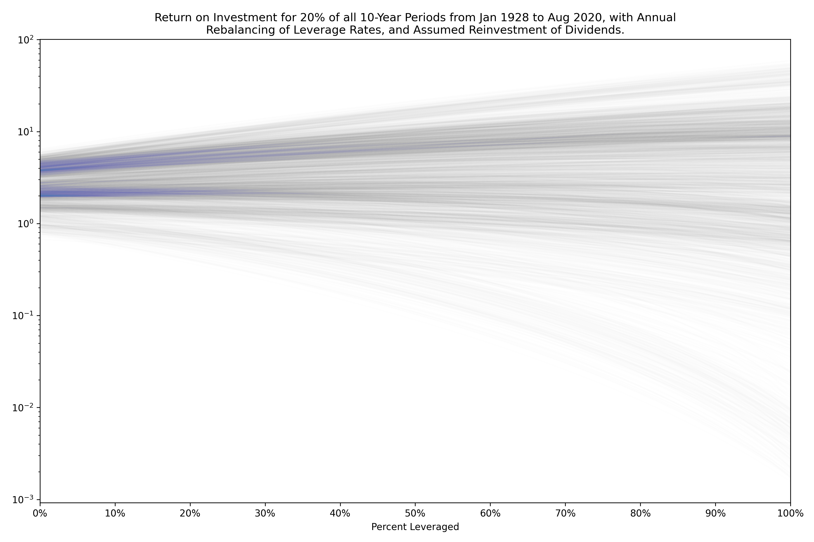

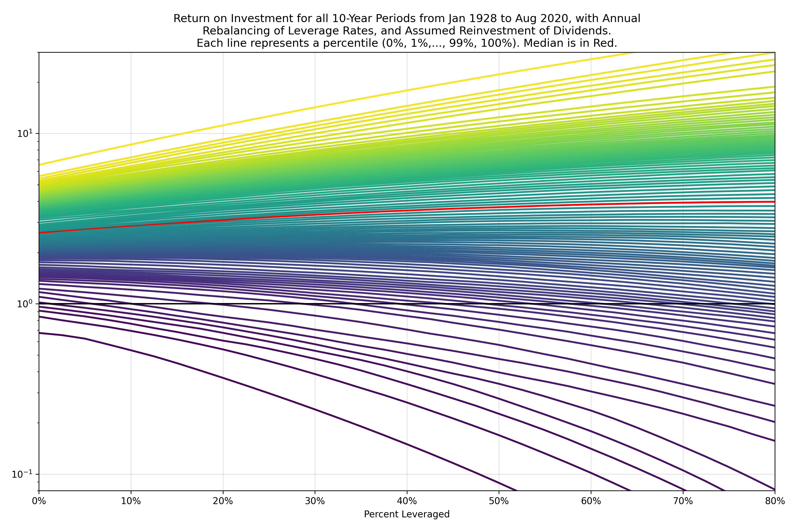

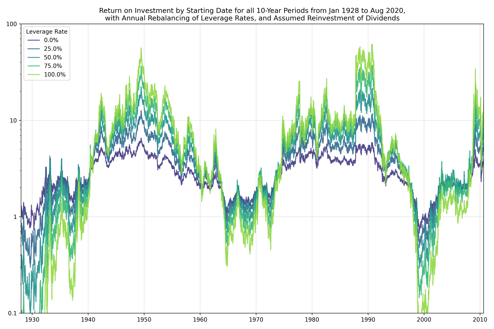

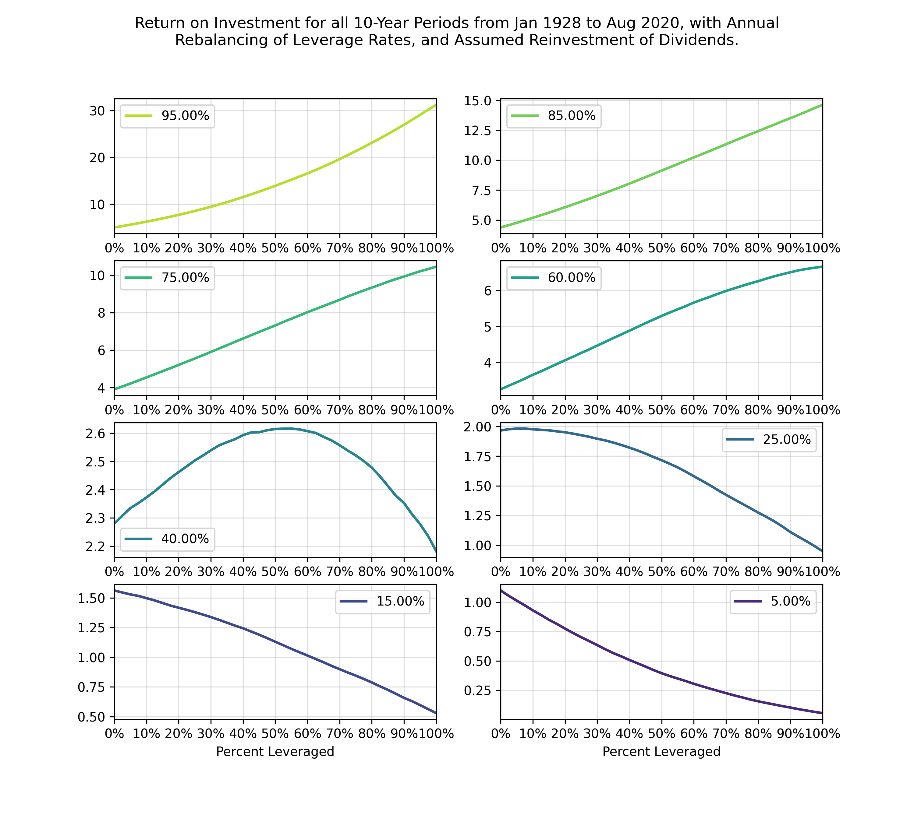

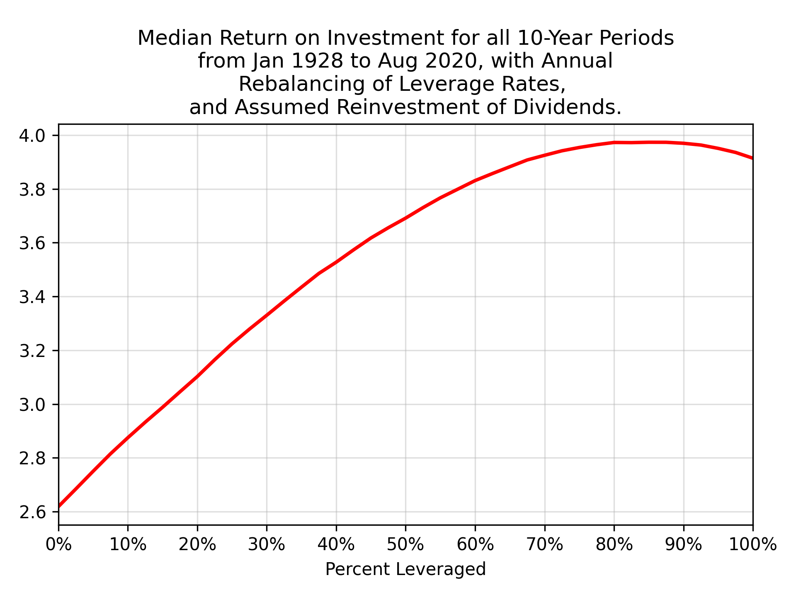

## Returns Relative to the Baseline (100% S&P 500, 0% leverage)

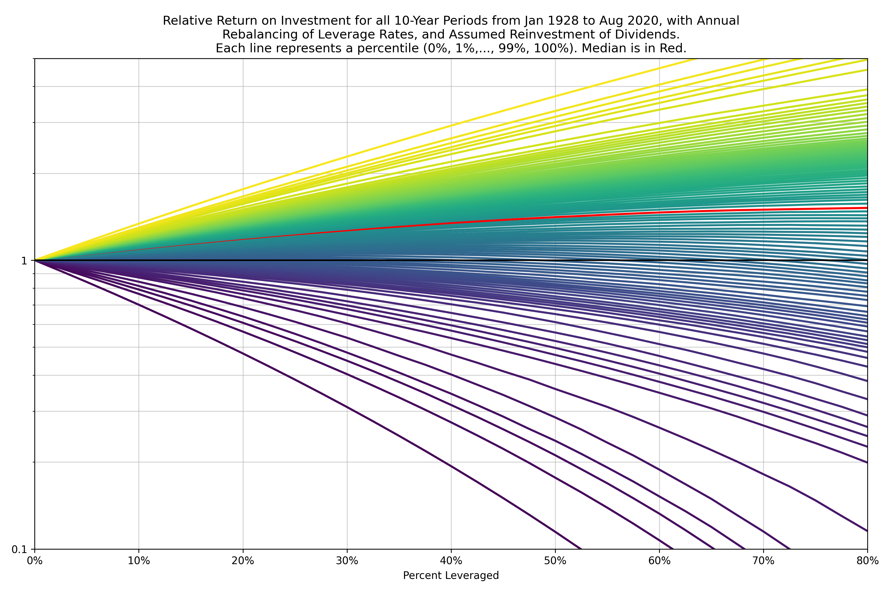

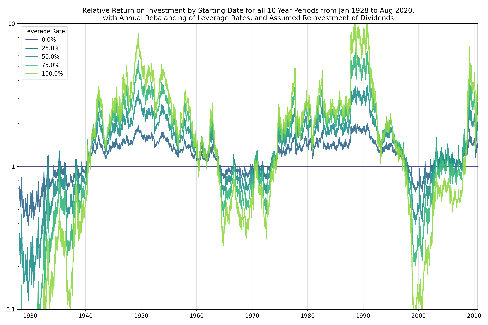

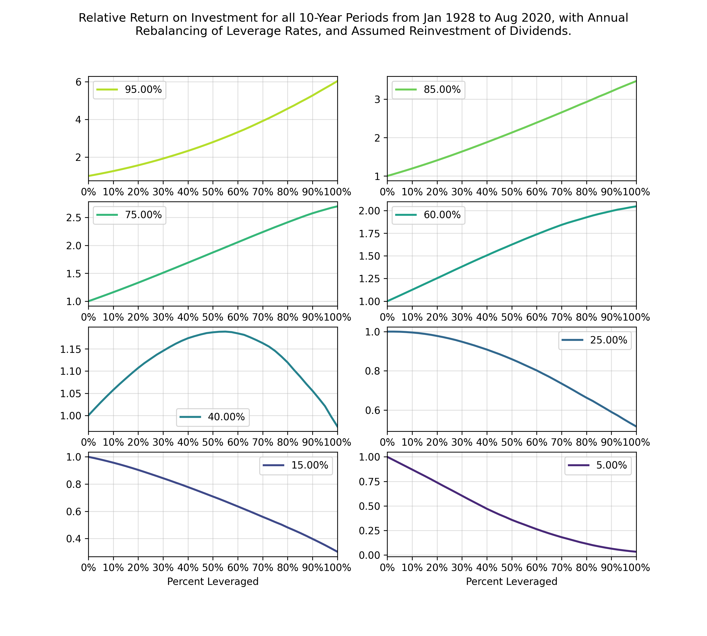

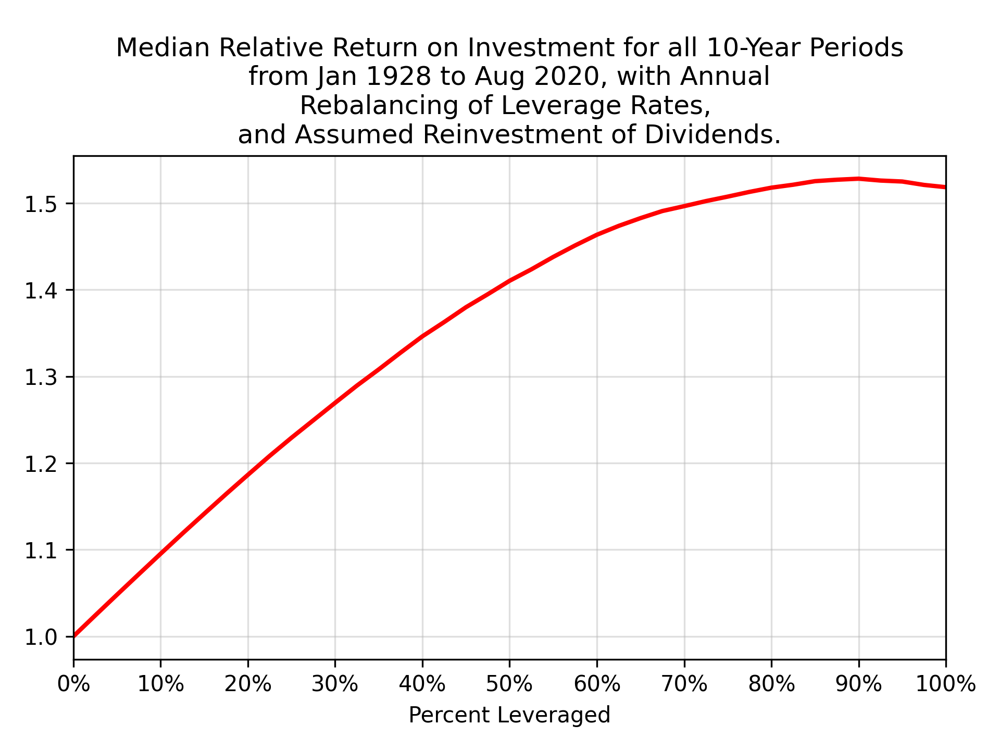

## Optimal Leverage for Each Percentile

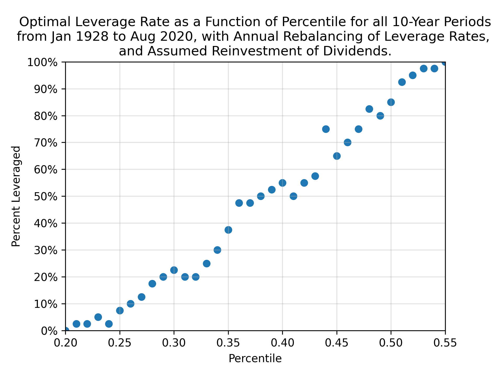

## Percentiles based on the S&P 500 performance

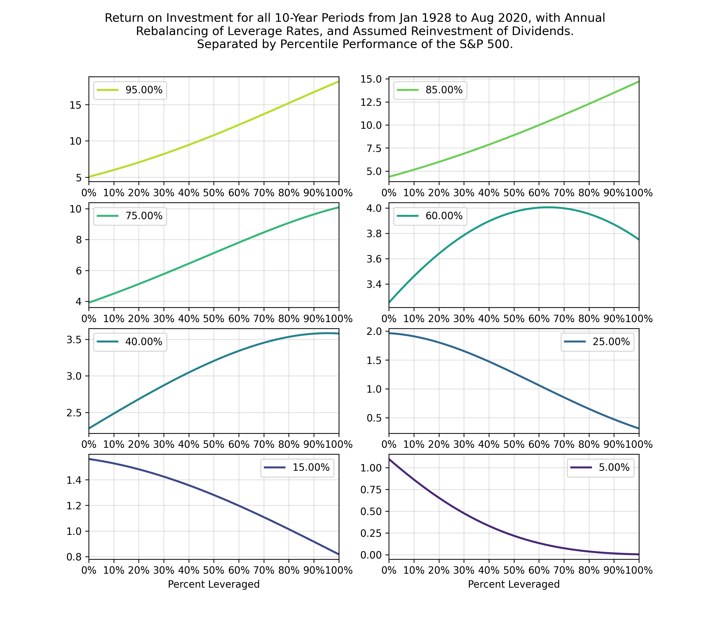

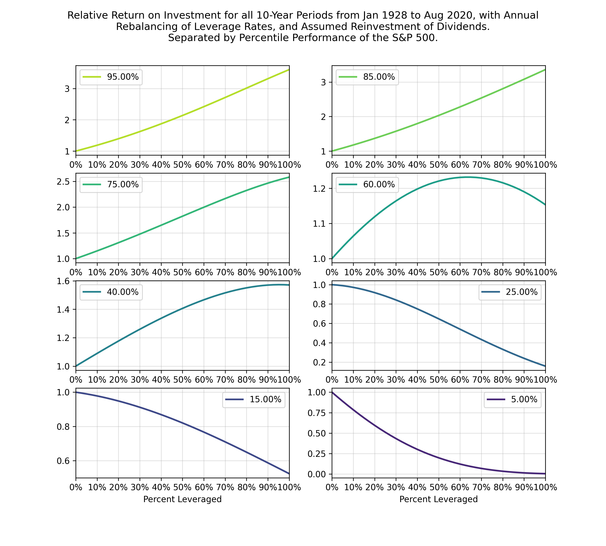

